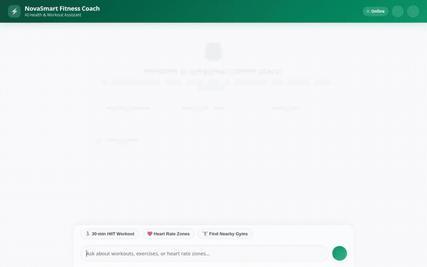

# NovaSmart Fitness Coach

An intelligent, multi-tool AI health and workout assistant built with the **Google Agent Development Kit (ADK)** and **Vertex AI Agent Engine**. NovaSmart Fitness Coach delivers personalized workout planning, target heart rate calculation, real-time nearby gym discovery, AI-generated exercise diagrams and videos, and long-term session memory.



---

## ✨ Features & Capabilities

The agent implementation in this repository includes the following capabilities:

* **🧠 Cross-Session Memory (Vertex AI Memory Bank)**
  * Uses `PreloadMemoryTool` and automated memory extraction callbacks to remember user preferences, fitness goals, injuries, and past workout history across separate sessions.

* **🏋️ Workout Routines & History (Google Cloud Firestore)**
  * Queries structured workout programs from the `workout_routines` Firestore collection.
  * Logs completed user workout sessions into the `user_workout_logs` Firestore collection.

* **🔍 Public Exercise Database Integration**
  * Searches exercise routines, target muscle groups, and movement instructions via external API integration.

* **📊 Visual Exercise Diagrams (Vertex AI Imagen 3)**
  * Generates custom anatomical exercise diagrams using `imagen-3.0-generate-002`, returning publicly accessible Google Cloud Storage media URLs.

* **🎥 Short Exercise Demonstration Videos (Gemini Omni)**
  * Generates short movement demonstration videos using Google's `gemini-omni-flash-preview` via the Vertex AI Interactions API.
  * Saves generated video files as session artifacts and uploads video bytes directly to Google Cloud Storage.

* **📍 Nearby Gym & Location Discovery (Google Maps API)**
  * Geocodes user addresses and searches nearby gyms, fitness centers, and sports facilities using Google Maps Places API.

* **❤️ Physiological & Environmental Calculations**
  * Calculates personalized target heart rate training zones (Fat-Burn, Aerobic, Peak) based on user age and resting metrics.
  * Fetches real-time weather forecasts to recommend indoor vs. outdoor workouts.

* **🎨 Rich Declarative UI (A2UI)**
  * Renders native A2UI cards, columns, rows, and visual items in supported client interfaces.

* **📱 Responsive Web Chat Interface**
  * Custom FastAPI chat web app featuring Dark/Light mode, speech-to-text voice input (Web Speech API), interactive prompt pills, and touch/iOS safe-area optimizations.

---

## 🛠️ Tech Stack & Architecture

* **Framework**: Google Agent Development Kit (ADK)
* **LLM Engine**: Gemini Flash (`gemini-flash-latest`) & Vertex AI Reasoning Engine (Agent Runtime)
* **Image & Video Generation**: Vertex AI Imagen 3 (`imagen-3.0-generate-002`) & Gemini Omni (`gemini-omni-flash-preview`)
* **Long-Term Memory**: Vertex AI Memory Bank
* **Database & Storage**: Google Cloud Firestore & Google Cloud Storage
* **Location Services**: Google Maps Places API & Geocoding API
* **Frontend Proxy**: FastAPI & Uvicorn with Vanilla JS / HTML5 CSS design system

---

## 🚀 Local Setup & Running Instructions

### Prerequisites

* Python 3.11+
* Google Cloud SDK (`gcloud` CLI) authenticated with access to Vertex AI, Firestore, and Cloud Storage.
* Active Google Maps API key (for location tools).

### 1. Installation

Clone the repository and install the dependencies:

```bash
python -m venv .venv
source .venv/bin/activate
pip install -e .
```

### 2. Environment Configuration

Create a `.env` file in the project root:

```bash
FIRESTORE_PROJECT="<your_gcp_project_id>"
MEDIA_BUCKET_NAME="<your_gcs_media_bucket_name>"
GOOGLE_MAPS_API_KEY="<your_google_maps_api_key>"
GOOGLE_CLOUD_PROJECT="<your_gcp_project_id>"
GOOGLE_CLOUD_LOCATION="us-east1"
```

### 3. Run the Agent Locally

You can test the agent locally using the ADK Development Server:

```bash
agents-cli dev
```

### 4. Run the Web Frontend Locally

Navigate to the `frontend/` directory and launch the FastAPI web application:

```bash
cd frontend
export AGENT_ENGINE_RESOURCE_NAME="projects/<PROJECT_ID>/locations/<REGION>/reasoningEngines/<ENGINE_ID>"
export AGENT_DIRECTORY="app"
python main.py
```

Open a web browser and navigate to the local server port displayed by Uvicorn (default: port 8080).

---

## ☁️ Deployment

Deploy the agent to Vertex AI Agent Runtime:

```bash
agents-cli deploy --no-confirm-project
```

Deploy the frontend container to Cloud Run:

```bash
cd frontend
gcloud run deploy fitness-coach-frontend \
  --source . \
  --region us-east1 \
  --allow-unauthenticated \
  --set-env-vars "AGENT_ENGINE_RESOURCE_NAME=projects/<PROJECT_ID>/locations/<REGION>/reasoningEngines/<ENGINE_ID>,AGENT_DIRECTORY=app"
```
