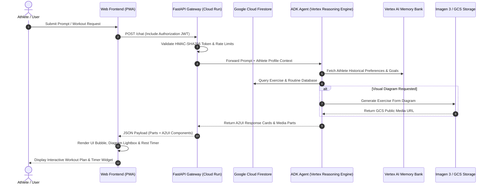

# NovaSmart Fitness Coach

An intelligent, multi-tool AI health and workout assistant built with the **Google Agent Development Kit (ADK)** and **Vertex AI Agent Engine**. NovaSmart Fitness Coach delivers personalized workout planning, target heart rate calculation, real-time nearby gym discovery, AI-generated exercise diagrams and videos, long-term session memory, and registered user authentication.


---

## ✨ Features & Capabilities

The agent implementation in this repository includes the following capabilities:

* **🔐 Registered User Authentication & Security**
  * Server-side user verification powered by **Google Cloud Firestore**.
  * Cryptographic **SHA-256 + HMAC salt** password hashing.
  * Signed **HMAC-SHA256 JWT (JSON Web Token)** session tokens for stateless client verification.
  * **Rate limiting middleware** (35 requests/minute per client IP) protecting against API abuse.
  * Standard production security headers (`X-Content-Type-Options: nosniff`, `X-Frame-Options: DENY`, `X-XSS-Protection`).

* **🧠 Cross-Session Memory (Vertex AI Memory Bank)**
  * Uses `PreloadMemoryTool` and automated memory extraction callbacks to remember user preferences, fitness goals, injuries, and past workout history across separate sessions.

* **🏋️ Workout Routines & History (Google Cloud Firestore)**
  * Queries structured workout programs from the `workout_routines` Firestore collection.
  * Logs completed user workout sessions into the `user_workout_logs` Firestore collection.

* **🔍 Public Exercise Database Integration**
  * Searches exercise routines, target muscle groups, and movement instructions via external API integration.

* **📊 Visual Exercise Diagrams (Vertex AI Imagen 3)**
  * Generates custom anatomical exercise diagrams using `imagen-3.0-generate-002`, returning publicly accessible Google Cloud Storage media URLs.

* **🎥 Short Exercise Demonstration Videos (Gemini Omni)**
  * Generates short movement demonstration videos using Google's `gemini-omni-flash-preview` via the Vertex AI Interactions API.
  * Saves generated video files as session artifacts and uploads video bytes directly to Google Cloud Storage.

* **📍 Nearby Gym & Location Discovery (Google Maps API)**
  * Geocodes user addresses and searches nearby gyms, fitness centers, and sports facilities using Google Maps Places API.

* **❤️ Physiological & Environmental Calculations**
  * Calculates personalized target heart rate training zones (Fat-Burn, Aerobic, Peak) based on user age and resting metrics.
  * Fetches real-time weather forecasts to recommend indoor vs. outdoor workouts.

* **🎨 Rich Declarative UI (A2UI)**
  * Renders native A2UI cards, columns, rows, and visual items in supported client interfaces.

* **📱 Progressive Web App (PWA) & Responsive Web Chat**
  * Glassmorphism authentication modal, dark/light mode toggle, PWA manifest (`manifest.json`), interactive interval workout timer, calorie/macro calculator widget, full-screen media lightbox, and speech-to-text voice input.

---

## 🛠️ System Architecture & Data Flow

### 🏗️ High-Level System Topology

```
+-----------------------------------------------------------------------------------+
|                                  CLIENT LAYER                                     |
|  [ Progressive Web App (PWA) / Desktop Browser / Mobile UI (Vanilla JS & HTML5) ]  |
+----------------------------------------+------------------------------------------+
                                         |
                                         | HTTP / REST (JWT Auth, Security Headers)
                                         v
+-----------------------------------------------------------------------------------+
|                             FASTAPI GATEWAY / PROXY                               |
|  * Auth Verification (Firestore Salted SHA-256 + HMAC-SHA256 JWT Tokens)         |
|  * Sliding-Window Rate Limiting (35 req/min per Client IP)                       |
|  * A2UI Response & Media Payload Parser                                           |
+----------------------------------------+------------------------------------------+
                                         |
                                         | Vertex AI A2A Protocol / Reasoning Engine
                                         v
+-----------------------------------------------------------------------------------+
|                          GOOGLE AGENT DEVELOPMENT KIT (ADK)                       |
|                               (Reasoning Engine)                                  |
|                                                                                   |
|   +-----------------------+   +----------------------+   +--------------------+   |
|   |  PreloadMemoryTool    |   |  Imagen 3 Tool       |   | Gemini Omni Tool   |   |
|   | (Vertex Memory Bank)  |   | (Exercise Diagrams)  |   | (Demo Videos)      |   |
|   +-----------+-----------+   +----------+-----------+   +---------+----------+   |
|               |                          |                         |              |
|               |                          |                         |              |
|               v                          v                         v              |
|   +-----------------------+   +----------------------+   +--------------------+   |
|   | Google Cloud          |   | Google Cloud         |   | Google Maps        |   |
|   | Firestore DB          |   | Storage (GCS)        |   | Places API         |   |
|   +-----------------------+   +----------------------+   +--------------------+   |
+-----------------------------------------------------------------------------------+
```

---

### 🔄 End-to-End Execution Sequence



---

### 🧱 Core Architectural Components

| Component Layer | Technology | Primary Function |
| :--- | :--- | :--- |
| **Frontend UI** | HTML5, Vanilla CSS, JS, Leaflet | Responsive PWA chat UI with Athlete Settings, Training Log, 5-Zone HR card, Leaflet Gym map, Water Tracker, BMI calculator, Exercise substitute finder, and printable PDF exporter. |
| **Backend Gateway** | FastAPI, Uvicorn, Python 3.11+ | Stateless API proxy managing authentication, rate limiting middleware, session tokens, and forwarding requests to Vertex Reasoning Engine. |
| **Agent Reasoning Engine**| Google Agent Development Kit (ADK) | Orchestrates LLM logic (`gemini-flash-latest`), tool execution, callback handlers, and A2UI card generation. |
| **User Authentication** | SHA-256 + HMAC Salt, JWT, Firestore | Secure client registration & login with salted password hashing and signed JWT session tokens stored in Firestore `app_users`. |
| **Long-Term Memory** | Vertex AI Memory Bank | Cross-session memory bank automatically persisting athlete fitness goals, injuries, and preferences across sessions. |
| **Media Generation** | Imagen 3 & Gemini Omni | Real-time generation of anatomical exercise diagrams (`imagen-3.0-generate-002`) uploaded to GCS buckets. |
| **Database & Storage** | Google Cloud Firestore & GCS | Document database for workout routines and logs; object storage for exercise image/video media assets. |

---

## 🚀 Local Setup & Running Instructions

### Prerequisites

* Python 3.11+
* Google Cloud SDK (`gcloud` CLI) authenticated with access to Vertex AI, Firestore, and Cloud Storage.
* Active Google Maps API key (for location tools).

### 1. Installation

Clone the repository and install the dependencies:

```bash
python -m venv .venv
source .venv/bin/activate
pip install -e .
```

### 2. Environment Configuration

Create a `.env` file in the project root:

```bash
FIRESTORE_PROJECT="<your_gcp_project_id>"
MEDIA_BUCKET_NAME="<your_gcs_media_bucket_name>"
GOOGLE_MAPS_API_KEY="<your_google_maps_api_key>"
GOOGLE_CLOUD_PROJECT="<your_gcp_project_id>"
GOOGLE_CLOUD_LOCATION="us-east1"
```

### 3. Run Automated Backend Tests

Execute the backend test suite to verify security & auth endpoints:

```bash
python3 -m unittest frontend/tests/test_backend.py
```

### 4. Run the Web Frontend Locally

Navigate to the `frontend/` directory and launch the FastAPI web application:

```bash
cd frontend
export AGENT_ENGINE_RESOURCE_NAME="projects/<PROJECT_ID>/locations/<REGION>/reasoningEngines/<ENGINE_ID>"
export AGENT_DIRECTORY="app"
python main.py
```

Open a web browser and navigate to `http://localhost:8080`.

---

## ☁️ Deployment

Deploy the agent to Vertex AI Agent Runtime:

```bash
agents-cli deploy --no-confirm-project
```

Deploy the frontend container to Cloud Run:

```bash
cd frontend
gcloud run deploy fitness-coach-frontend \
  --source . \
  --region us-east1 \
  --allow-unauthenticated \
  --set-env-vars "AGENT_ENGINE_RESOURCE_NAME=projects/<PROJECT_ID>/locations/<REGION>/reasoningEngines/<ENGINE_ID>,AGENT_DIRECTORY=app,FIRESTORE_PROJECT=<PROJECT_ID>"
```
